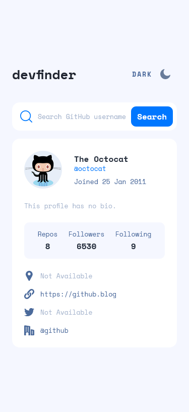
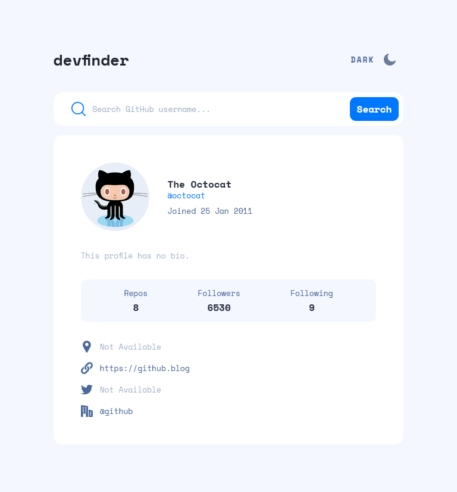
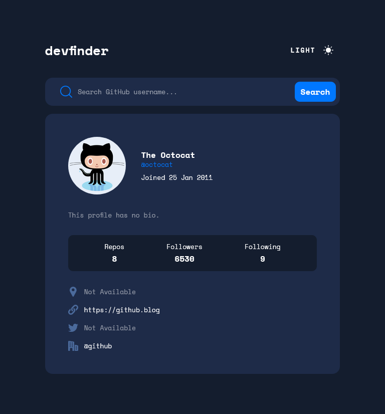
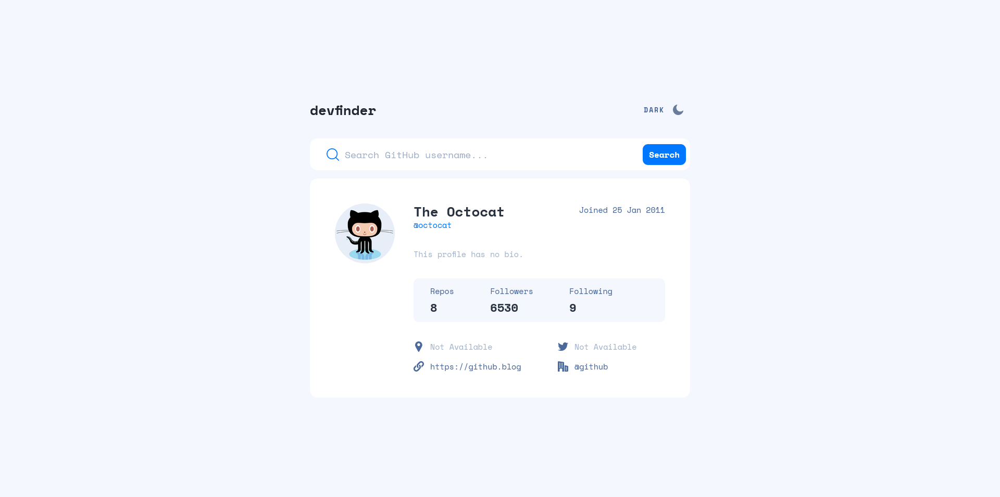
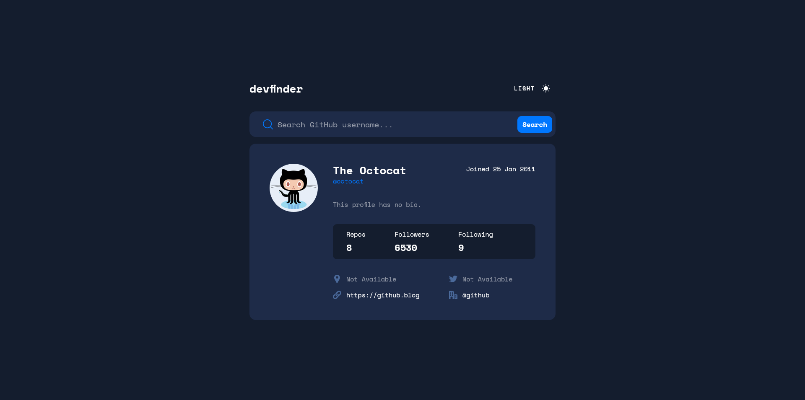

# Frontend Mentor - GitHub user search app solution

This is a solution to the [GitHub user search app challenge on Frontend Mentor](https://www.frontendmentor.io/challenges/github-user-search-app-Q09YOgaH6). Frontend Mentor challenges help you improve your coding skills by building realistic projects.

### Screenshot

- 
- 
- 
- 
- 
- 

### Links

- Solution URL: [Frontend Mentor Solution Page](https://www.frontendmentor.io/solutions/github-user-search-app-QzTSC77ghU)
- Live Site URL: [GitHub Pages Site](https://karolbanat.github.io/github-user-search-app/)

## My process

### Built with

- Semantic HTML5 markup
- CSS/SCSS
- Flexbox
- CSS Grid
- Mobile-first workflow

## Author

- Frontend Mentor - [@karolbanat](https://www.frontendmentor.io/profile/karolbanat)
